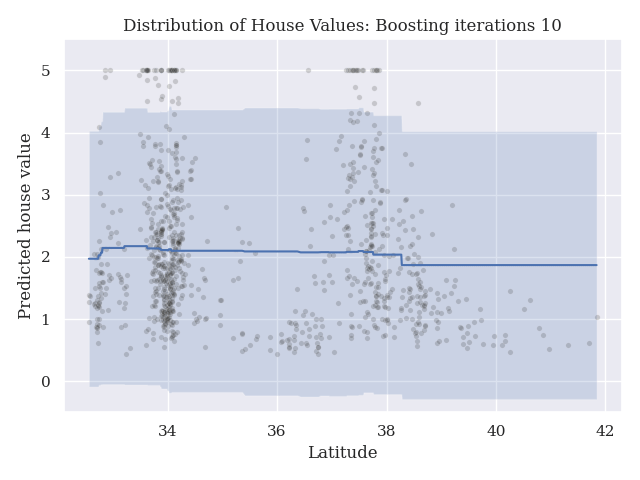

# LegateBoost

GBM implementation on Legate. The primary goals of LegateBoost is to provide a state-of-the-art distributed GBM implementation on Legate, capable of running on CPUs or GPUs at supercomputer scale.


For developers - see [contributing](contributing.md)

## Example

Run with the legate launcher
```bash
legate example_script.py
```

```python
import cunumeric as cn
import legateboost as lb

X = cn.random.random((1000, 10))
y = cn.random.random(X.shape[0])
model = lb.LBRegressor(verbose=1, n_estimators=100, random_state=0, max_depth=2).fit(
    X, y
)
```

## Features

### Probabilistic regression



## Installation

Dependencies:
- cunumeric
- sklearn

From the project directory
```
pip install .
```
